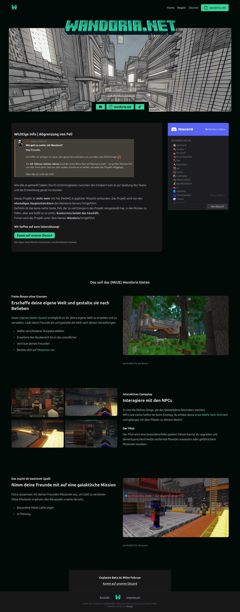

[](https://github.com/KalypzoSolutions/wandoria-svelte/actions/workflows/deploy.yml)

# Wandoria-Svelte
Hierbei handelt es sich um die Implementierung der Website mithilfe von Svelte-Kit. 

Github Actions lädt die Seite automatisch auf github-pages hoch. 

Die Syntax ist identisch mit purem HTML (Kein JSX / TSX). 


## Entwicklung starten

1. Installiere [Bun.js](https://bun.sh/) mit 
```bash
powershell -c "irm bun.sh/install.ps1 | iex"
```

2. Öffne das Projekt in Visual Studo Code

3. Installiere die Dependencies mit 
```bash
bun i
```


```bash
bun run dev

# or start the server and open the app in a new browser tab
bun run dev -- --open
```

# Seitenvorschau


